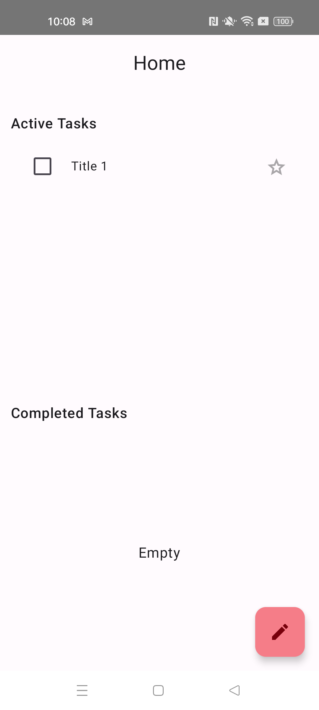
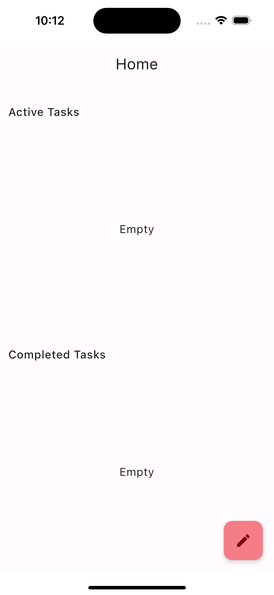

This is a Kotlin Multiplatform project targeting Android, iOS.
 #### KMP ToDo App
This is a simple ToDo app that demonstrates the use of Kotlin Multiplatform to share code between Android and iOS. 
The app uses Kotlin Multiplatform to share the business logic and data model between the two platforms. 
The UI is implemented natively on each platform using Jetpack Compose on Android and SwiftUI on iOS.
#### Using libraries
1. Voyeger for navigation
2. Koin for dependency injection
3. Realm for database
4. Coroutines for async programming
5. Stately for state management
#### Running the app
To run the app, you need to have Android Studio and Xcode installed on your machine. 
You also need to have the Android and iOS SDKs installed. 
You can then open the project in Android Studio and run the app on an Android emulator or device. 
To run the app on iOS, you need to open the project in Xcode and run the app on an iOS simulator or device.
#### Screenshots

| Android                             | IOS                         |
|-------------------------------------|-----------------------------|
|  |  |
